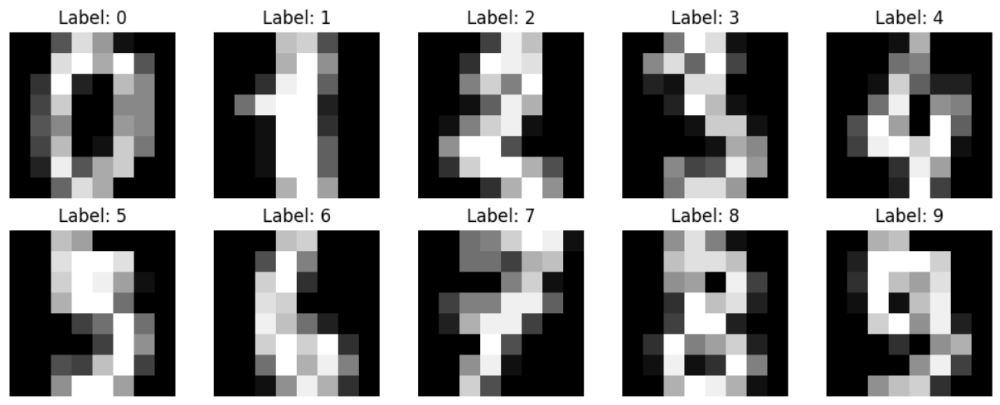
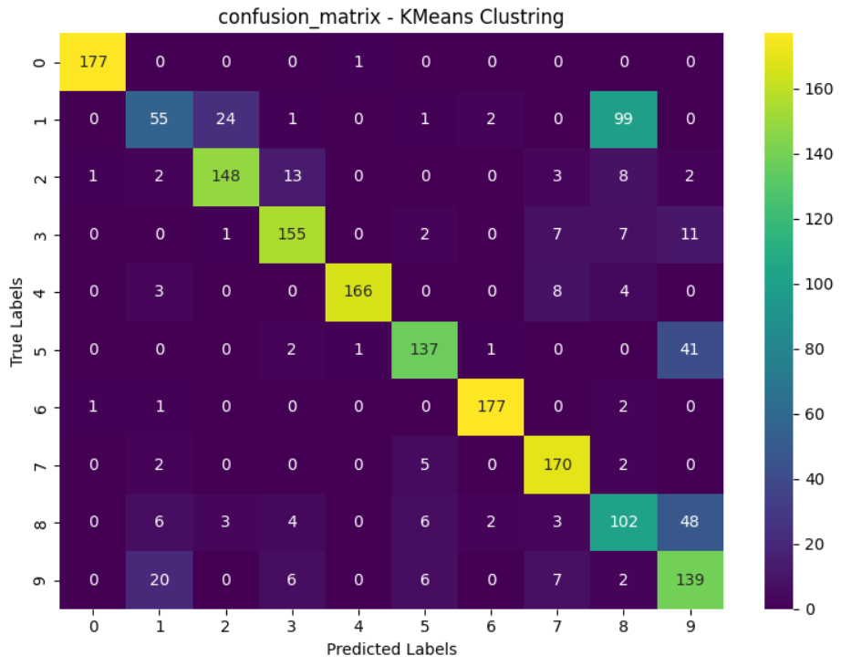
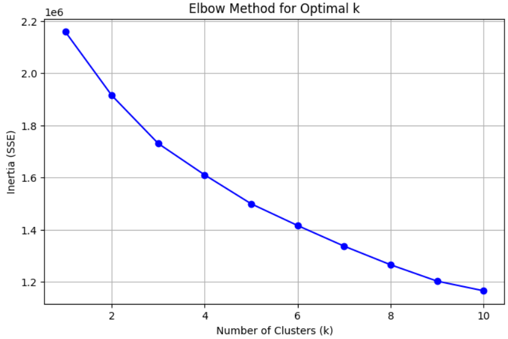

# 📌 پروژه: خوشه‌بندی ارقام دست‌نویس با K-Means  
# 📌 Project: Handwritten Digits Clustering with K-Means

---

## 📝 توضیح کلی | Description

این پروژه از الگوریتم K-Means برای خوشه‌بندی تصاویر سیاه‌وسفید ارقام دست‌نویس استفاده می‌کند. هدف این است که داده‌ها بدون داشتن برچسب‌های واقعی، به‌درستی خوشه‌بندی شوند و سپس دقت آن با برچسب‌های اصلی سنجیده شود.

This project uses the K-Means algorithm to cluster grayscale images of handwritten digits from the `Digits` dataset. The aim is to cluster the data without using labels and evaluate clustering performance by comparing it with true labels.

---

## 🧾 دیتاست | Dataset

- دیتاست `Digits` از مجموعه `sklearn.datasets` گرفته شده.
- شامل ۱۷۹۷ تصویر ۸×۸ از ارقام ۰ تا ۹.
- هر تصویر به یک وکتور ۶۴تایی از پیکسل‌ها تبدیل شده است.
- شامل برچسب واقعی برای هر تصویر می‌باشد.

- The `Digits` dataset is loaded from `sklearn.datasets`.
- Contains 1,797 images of digits (0 to 9), each 8x8 pixels.
- Each image is flattened into a 64-feature vector.
- Labels are available for each sample for validation.

---

## 🔁 مراحل انجام پروژه | Project Steps

**فارسی:**

1. بارگذاری دیتاست و نمایش نمونه‌ها  
2. خوشه‌بندی داده‌ها با الگوریتم K-Means  
3. تطبیق برچسب خوشه‌ها با برچسب واقعی  
4. محاسبه دقت خوشه‌بندی  
5. رسم ماتریس درهم‌ریختگی  
6. رسم نمودار Elbow برای تعیین k بهینه

**English:**

1. Load and visualize the dataset  
2. Cluster data using K-Means  
3. Match cluster labels with actual labels using mode  
4. Compute clustering accuracy  
5. Plot confusion matrix  
6. Use Elbow method to determine optimal number of clusters (k)

---
 📌نمونه تصاویر دیتاست | Sample Digits from Dataset



---

📌 ماتریس درهم‌ریختگی | Confusion Matrix (KMeans Clustering)



---

📌 نمودار Elbow | Elbow Method Chart



---

## 💻 اجرای کد | How to Run

**پیش‌نیازها | Requirements**:

```bash
pip install numpy matplotlib seaborn scikit-learn scipy

---
## About Me | درباره من

👋 My name is **Abolfazl Karimi**. I am a professional AI programmer specializing in developing real-world machine learning and deep learning projects. 
📫 Contact me via Email: karimiabolfazl466@gmail.com  
📱 Telegram: [@Abolfazlk83](https://t.me/Abolfazlk83)   
🌐 LinkedIn: ***  
🐙 GitHub: [github.com/abolfazlkarimi83](https://github.com/abolfazlkarimi83)

---

👋 من **ابوالفضل کریمی** هستم، برنامه‌نویس حرفه‌ای هوش مصنوعی با تخصص در توسعه پروژه‌های عملی یادگیری ماشین و یادگیری عمیق.  
📫 ایمیل: karimiabolfazl466@gmail.com  
📱 تلگرام: [@Abolfazlk83](https://t.me/Abolfazlk83)  
🌐 لینکدین: *** 
🐙 گیت‌هاب: [github.com/abolfazlkarimi83](https://github.com/abolfazlkarimi83)
